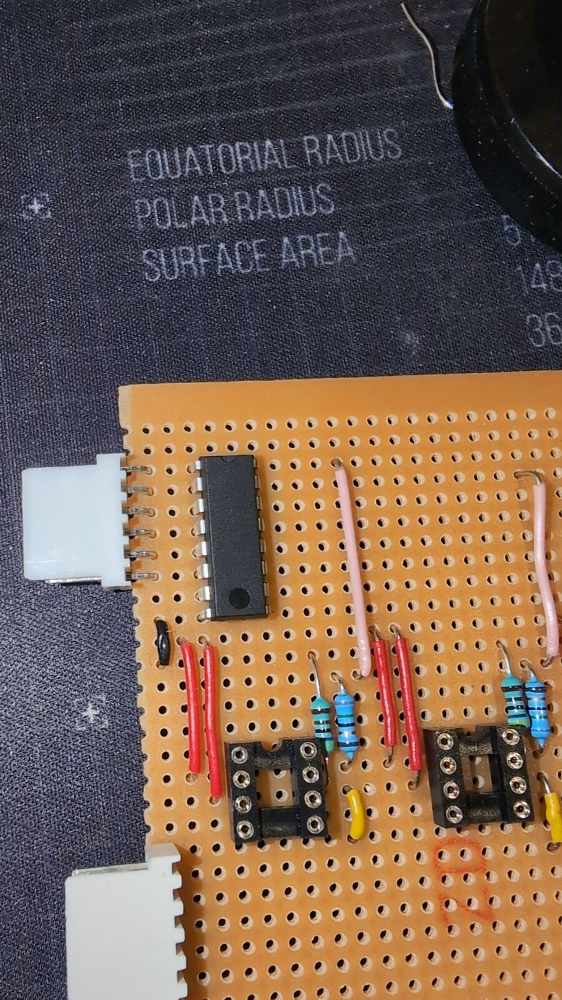
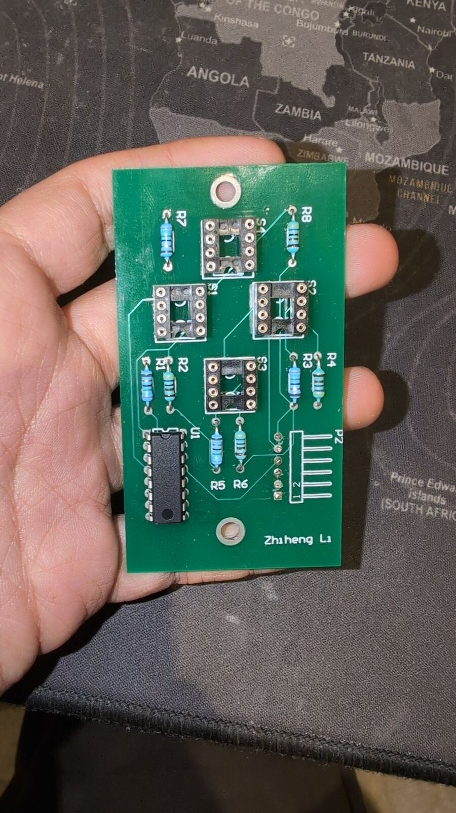
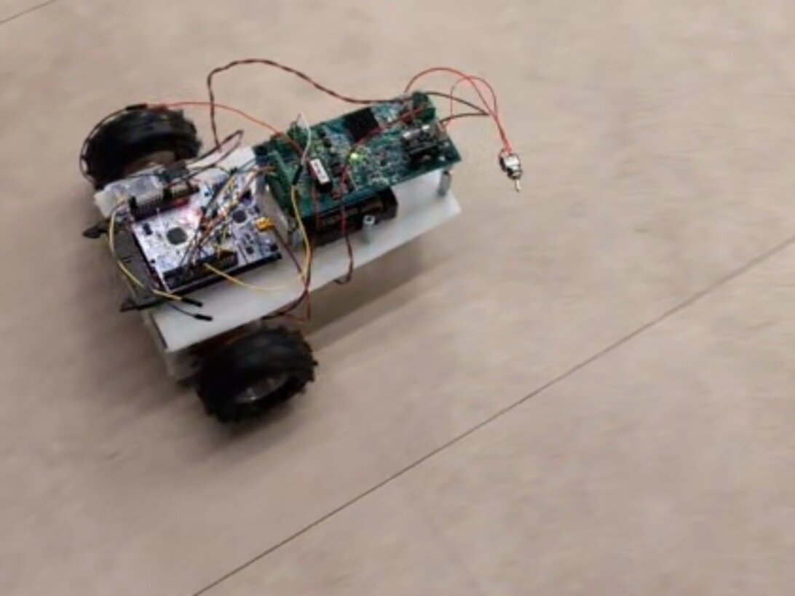

# Autonomous Line-Following Buggy Firmware (buggyHAL)


> **Archival Notice:** This repository contains the firmware developed for an electronic engineering
> group project at The University of Manchester. It is **no longer maintained** and is preserved here
> for historical, educational, and portfolio reference. See
> [Project Status](#project-status) for an honest account of what was completed.

---

## Overview

**buggyHAL** is a bare-metal embedded C firmware application for an autonomous line-following
robotic buggy built on the **STM32F401RETx** ARM Cortex-M4 microcontroller (NUCLEO-F401RE board).

The firmware uses STM32 Hardware Abstraction Layer (HAL) drivers to bring up a complete mobile
robot platform: quadrature encoder odometry, closed-loop wheel-speed control, dual H-bridge motor
drive, a DMA-fed multi-channel infrared reflectance sensor front end, and a Bluetooth Low Energy
(BLE) serial link — all coordinated by a table-driven finite state machine.

---

## Key Features

- **Table-Driven Finite State Machine** — Four states (`RESET`, `IDLE`, `TUNE`, `CONSTANT_SPEED`)
  with separate *enter* / *in-state* / *exit* handlers dispatched through `const` function-pointer
  tables, giving predictable, branch-light transitions. Transitions are driven by an EXTI interrupt
  on the user button (PC13).
- **Closed-Loop Wheel-Speed Control** — An independent PID controller per wheel, running from a
  hardware timer interrupt. Velocity is derived from quadrature encoder deltas, smoothed by a
  128-tap moving-average filter, and drives the motor PWM duty cycle. Includes integrator clamping
  for anti-wind-up and configurable output limits.
- **Quadrature Encoder Odometry** — Two 32-bit hardware timers in encoder interface mode (TI12,
  4× decoding) count wheel ticks with zero CPU cost; position and velocity are sampled in the
  control ISR.
- **DMA-Backed Multi-Channel ADC** — ADC1 configured for 12-bit scan + continuous conversion across
  five reflectance-sensor channels (`ADC1_IN11`–`IN15`), routed through DMA2 Stream 0 in circular
  mode into a `ReadingADC[5]` buffer, so the sensor array can be sampled with no CPU intervention.
- **Hardware Timer Utilisation** — Dedicated timers for edge-aligned motor PWM generation
  (~28 kHz), quadrature pulse counting, and the periodic control-loop time base.
- **BLE / UART Link** — USART2 at 115200 8N1 in interrupt mode, wired to the BLE module's TX/RX
  pins for wireless communication with the buggy.

---

## System Architecture & Hardware

| Component | Peripheral | Pins | Description |
| :--- | :--- | :--- | :--- |
| **Microcontroller** | STM32F401RETx | — | 32-bit ARM Cortex-M4F @ 84 MHz (HSI + PLL) |
| **Line sensors** | ADC1 + DMA2 Stream 0 | PC1–PC5 | 5-channel IR reflectance array, 12-bit, circular DMA |
| **Sensor emitters** | GPIO (`Darl1`–`Darl5`) | PC6–PC8, PB8, PB9 | Darlington-driven IR emitter control |
| **Motor PWM** | TIM1 CH2 / CH3 | PA9, PA10 | ~28 kHz PWM, 3001-step duty resolution |
| **Motor direction** | GPIO | PB2, PB14 | Per-side H-bridge direction select |
| **Motor mode / enable** | GPIO | PB12, PB13, PC9 | Unipolar/bipolar select and global enable |
| **Left encoder** | TIM2 (encoder mode) | PA15, PB3 | 32-bit quadrature counter |
| **Right encoder** | TIM5 (encoder mode) | PA0, PA1 | 32-bit quadrature counter |
| **Control loop tick** | TIM3 (time base, IT) | — | Periodic interrupt driving the PID update |
| **BLE / comms** | USART2 | PA2, PA3 | 115200 8N1, interrupt-driven RX |
| **User button** | EXTI15_10 | PC13 | State-machine transition trigger |
| **Status LED** | GPIO | PA5 (LD2) | State indicator |

### Control Flow

```
TIM3 period-elapsed ISR
        │
        ├─ updateEncoder()      read TIM2/TIM5 counters → position, velocity
        ├─ computeFilter()      128-tap moving average per wheel
        ├─ PIDController_Update()   setpoint vs. filtered velocity → PWM
        └─ MOTOR_{LEFT,RIGHT}_SetPWM()   direction GPIO + TIM1 compare register
```

The `main()` super-loop does nothing but call `StateMachine()`, which dispatches into the
function-pointer tables; all real-time work happens in interrupt context.

---

## Project Status

This was a time-boxed academic project, and it is archived in the state it was left. Being clear
about that is more useful to anyone reading the code than pretending otherwise.

**Implemented and working:**

- Full peripheral bring-up (clocks, GPIO, ADC, DMA, timers, USART) via STM32CubeMX
- Motor drive abstraction with direction handling and duty-cycle clamping
- Quadrature encoder odometry with moving-average velocity filtering
- Per-wheel PID speed controller with integrator clamping and output limiting
- Table-driven finite state machine with button-driven transitions
- USART2/BLE interrupt-driven receive path

**Configured but not activated:**

- **Line sensing.** `Core/Src/Sensors.c` and `Core/Inc/Sensors.h` are stubs. The ADC and its
  circular DMA stream are fully configured, but the `HAL_ADC_Start_DMA()` call in `main.c` is
  commented out, so `ReadingADC[]` is never populated.
- **Line-following steering.** No steering controller was written. The PID loops regulate wheel
  *speed*, not line deviation, so the buggy holds a commanded velocity but does not yet track a line.
- **`CONSTANT_SPEED` state.** The state and its handlers exist, but the `TUNE → CONSTANT_SPEED`
  transition is commented out in `StateMachine.c`, so the state is currently unreachable.
- **BLE protocol.** `BLE.c` echoes received bytes straight back on USART2. The intended telemetry
  and gain-tuning protocol was never built on top of it.

**Known issues left in the code:**

- `MOTOR_RIGHT_SetPWM()` in `Motors.c` branches on the uninitialised local `_PWM` instead of the
  `PWM` argument, so the right motor's direction pin can be set from an indeterminate value.
- `MOTORS_Reset()` writes `unipolarLeft_Pin` against `unipolarRight_GPIO_Port`, so the right
  unipolar/bipolar select is never actually driven.
- `PIDController_Init()` computes `pid->T = samplingPeriod_ms / 1000` in integer arithmetic, which
  evaluates to `0` and disables the integral term's time scaling.
- The `SAMPLE_TIME` constant (10 ms) used by the encoder and PID maths does not match the TIM3
  reload configuration, which fires closer to ~1.4 ms.
- The derivative term in `PIDController_Update()` is commented out, so the controllers are
  effectively PI rather than PID.

These are documented rather than fixed: the repository is archived as a record of the project as
submitted.

**Unmerged branches:** `LineSenor` and `Development` contain exploratory work that never reached
`main`. `LineSenor` in particular holds a partial sensor front end — ADC DMA start/stop helpers and
the beginnings of a `linePosition()` centroid routine — but it does not compile and was abandoned
mid-edit. They are left in place as part of the historical record; `main` is the branch to read.

---

## Project Structure

```text
buggyHAL/
├── Core/
│   ├── Inc/                        # Application headers
│   │   ├── BLE.h                   # BLE / USART2 receive interface
│   │   ├── Encoder.h               # Encoder + moving-average filter structs
│   │   ├── Motors.h                # Motor drive & PWM API
│   │   ├── PID.h                   # PIDController struct and API
│   │   ├── Sensors.h               # Sensor interface (stub)
│   │   ├── StateMachine.h          # FSM states and handler declarations
│   │   ├── main.h                  # Pin definitions and global config
│   │   └── adc.h / dma.h / gpio.h / tim.h / usart.h
│   ├── Src/                        # Application sources
│   │   ├── BLE.c
│   │   ├── Encoder.c
│   │   ├── Motors.c
│   │   ├── PID.c
│   │   ├── Sensors.c               # (stub)
│   │   ├── StateMachine.c          # FSM dispatch tables, control-loop ISR
│   │   ├── main.c                  # Entry point, clock config, super-loop
│   │   ├── adc.c / dma.c / gpio.c / tim.c / usart.c
│   │   └── stm32f4xx_it.c          # Interrupt service routines
│   └── Startup/
│       └── startup_stm32f401retx.s
├── Drivers/                        # STM32F4xx HAL and CMSIS libraries
├── docs/
│   └── API_Doc_Group27.txt         # Original group API specification
├── buggy_Using_HAL.ioc             # STM32CubeMX pinout & clock configuration
├── buggy_Using_HAL_Debug.cfg       # OpenOCD target configuration
├── STM32F401RETX_FLASH.ld          # Linker script (execute from Flash)
└── STM32F401RETX_RAM.ld            # Linker script (execute from RAM)
```

## Gallery



*First cut of the line-sensor front end, hand-wired on perfboard — DIP sockets for the reflective
optopairs, a resistor pair per channel, point-to-point links, and polarised connectors for the
supply and analogue returns.*



*The same front end respun as a fabricated board: sockets `S1`–`S4` for the optopairs, `R1`–`R8`
setting emitter and detector bias, a 16-pin driver at `U1`, and header `P2` carrying the analogue
channels back to the NUCLEO.*



*The assembled buggy mid-run — controller and driver boards stacked over the drive axle on an
acrylic chassis, battery pack behind, and a toggle kill-switch on a flying lead. No sensor board is
fitted to the underside; the line-sensor hardware above never made it onto the finished vehicle.*

**▶ [Ground run — 13 s, no audio](docs/buggy-ground-run.mp4)**

*Closed-loop wheel-speed control in the `TUNE` state: the buggy holds a commanded velocity from
encoder feedback and tracks straight across an unmarked floor. There is no line and no steering
controller — see [Project Status](#project-status) for what that does and doesn't demonstrate.*

---

## Build & Flashing

### Prerequisites

- [STM32CubeIDE](https://www.st.com/en/development-tools/stm32cubeide.html) (recommended), or the
  GNU Arm Embedded Toolchain with Make
- An ST-LINK V2/V3 programmer, or the on-board ST-LINK of a NUCLEO-F401RE
- OpenOCD (optional — a target configuration is included)

### Building

1. Open STM32CubeIDE.
2. Choose **File → Open Projects from File System…** and select the repository root.
3. Build with **Project → Build Project** (`Ctrl+B`).

The build tree (`Debug/`, `Release/`) is generated by the IDE and is intentionally not tracked in
version control.

### Flashing

- **From the IDE:** use **Run → Debug** with the included ST-LINK launch configuration.
- **From the command line:** flash the resulting `.elf` with OpenOCD using
  `buggy_Using_HAL_Debug.cfg` as the target configuration.

### Regenerating peripheral code

`buggy_Using_HAL.ioc` is the STM32CubeMX project file. Opening it regenerates the peripheral
initialisation code — keep application logic inside the `/* USER CODE BEGIN */` … `/* USER CODE END */`
guards so it survives regeneration.

---

## Author & Attribution

**Dhari Almutairi** — [GitHub](https://github.com/DhariMT) ·
[LinkedIn](https://linkedin.com/in/dhari-almutairi-51a218416)

Developed as part of undergraduate studies in Electronic Engineering at
**The University of Manchester** (2023–2024).

Peripheral initialisation code is generated by STM32CubeMX; the HAL and CMSIS libraries under
`Drivers/` are © STMicroelectronics and distributed under their own licence terms.

---

## License

Released under the [MIT License](LICENSE).
